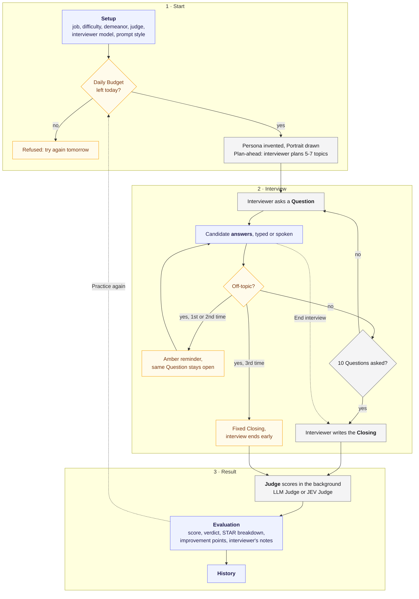
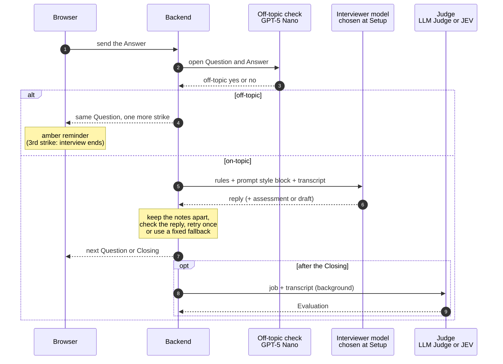

<!-- OWNER SECTION START: written by the owner. Agents leave everything up to OWNER SECTION END unchanged. -->
# Interview Practice

A single-user web app for rehearsing behavioral job interviews. An LLM plays the interviewer, asks up to ten questions with follow-ups, and a separate LLM judge scores every answer against STAR (Situation, Task, Action, Result), gives an overall score, a hiring verdict and three improvement points. Which model plays the interviewer, and how its prompt is built, can be chosen for every interview, so models and prompt styles can be compared.

The vocabulary used in the code and docs is defined in [`CONTEXT.md`](./CONTEXT.md). Architecture decisions are in [`docs/adr/`](./docs/adr/).

## How it works

1. **Setup**: enter the job title, optional industry, seniority and job description, and pick a difficulty, the interviewer's demeanor, the judge, a written or voice interview, the interviewer model and the prompt style. Pasting a job description lets the app suggest title, industry and seniority.
2. **Interview**: the interviewer greets you and asks the first question. Answer in text, or by voice in a voice interview. Follow-ups count toward the cap of ten. You can end early after at least one answer. An answer that tries to use the interviewer for something else gets a reminder; the third one ends the interview.
3. **Closing and judging**: after the last answer the interviewer writes a closing message and the judge starts in the background. When it finishes, "See evaluation" lights up.
4. **Evaluation**: overall score, verdict and justification, then improvement points and the transcript with a STAR breakdown under every answer. For some prompt styles, the interviewer's notes show what it planned or thought before each question. "Practice this job again" starts a fresh interview with the same settings.
5. **History**: all past interviews with status, score, interviewer model and prompt style. In-progress ones can be resumed.



Blue: what you do. Amber: the guards. Grey: what the models do.

## Experiments

<!-- Your findings. The tables are a starting point: fill in, add rows, delete what you don't need. -->

### How I tested

<!-- e.g. which job, difficulty and judge stayed the same, which answers you gave, how many interviews per combination -->

### Interviewer models

| Model | Price per 1M tokens (in / out) | Time per question | Quality of the questions | Average score | My verdict |
|---|---|---|---|---|---|
| GPT-4.1 Mini (baseline) | $0.40 / $1.60 | ~1 s | | | |
| GPT-5 Nano (cheapest) | $0.05 / $0.40 | ~10 s | | | |
| Claude Sonnet 5.5 (best) | $2 / $10 | ~2.5 s | | | |
| Gemma 4 31B (open model) | $0.14 / $0.40 | ~2.5 s | | | |

Times were measured once while building, on two questions per model.

### Prompt styles

| Prompt style | What the interviewer gets | What I noticed | Average score |
|---|---|---|---|
| Zero-shot | Only its rules | | |
| One-shot | One example exchange | | |
| Few-shot | Three example exchanges | | |
| Chain-of-thought | Writes an assessment of the last answer before asking | | |
| Plan-ahead | Plans 5 to 7 topics before the first question | | |
| Self-check | Drafts the question, checks it, then asks the corrected one | | |

### Security guards

| Guard | What I tried | What happened |
|---|---|---|
| Off-topic answers | | |
| Daily budget ($2) | | |

### Surprises

Found while building:

- Claude Sonnet 5.5 returned nothing for chain-of-thought when the prompt asked it to think "step by step" inside `<thinking>` tags: its provider filters that out. Asking for a short `<assessment>` instead works on all four models.
- GPT-4.1 Mini skipped the hidden steps of chain-of-thought and self-check until the prompt said every reply must have them, because its earlier questions in the conversation show none.
- The off-topic check with GPT-5 Nano got all six test answers right but takes 2 to 8 seconds. Made faster (less reasoning, or GPT-4.1 Nano), it also blocked weak but honest answers.

<!-- your own surprises -->

### Conclusion

<!-- Which model and prompt style would you use, and why? -->

## Not in this version

Streaming replies, technical interviews, timed answers, a curated question bank, PDF export, other languages, multiple users and deployment.

<!-- OWNER SECTION END -->

<!-- AGENT SECTION START: maintained by Claude and kept in sync with the code. -->

## Stack

| Part | Technology |
|---|---|
| Backend | Python 3.12, FastAPI, SQLAlchemy 2, SQLite, OpenAI SDK pointed at OpenRouter, pypdf for PDF uploads |
| Frontend | Next.js 16 (App Router), React 19, TypeScript, Tailwind v4 |
| Tests | pytest with a scripted fake LLM (no network, no key) |

The frontend is a thin client. Every page is a client component and all logic, including LLM calls, lives in the FastAPI backend (see ADR-0001).

Each Interview is scored by the Judge chosen on Setup: the LLM Judge, which writes feedback, or the JEV Judge, which only rates and gives its confidence (ADR-0003). The Evaluation page can run the other Judge on the same transcript and show both side by side.

A Voice Interview (chosen on Setup) reads every Question and the Closing aloud in the Persona's voice (`TTS_MODEL`) and adds a mic button to the Answer box: the recording is transcribed (`STT_MODEL`) into the box, where you edit it and send it like a typed Answer. No audio is stored (ADR-0004). Both directions use the audio chat model `openai/gpt-audio-mini`, prompted to read a text word for word or to write down a recording; the browser converts each recording to WAV first (ADR-0005). The mic works on http://localhost without HTTPS.

The interviewer's Demeanor is chosen on Setup, next to Difficulty: Friendly (the default) or Rude. A Rude interviewer is impatient, curt and sceptical from the greeting to the Closing, but never insults or swears; its Portrait looks stern with crossed arms. Only the interviewer and the Portrait see it: the Persona call and both Judges do not, so scores stay comparable.

For trying out models and prompts, Setup has two more choices; History shows them on every row:

- **Interviewer model**: who writes the Questions and the Closing. GPT-4.1 Mini (the default and baseline, no built-in reasoning), GPT-5 Nano (cheapest, but slow: it reasons before every reply), Claude Sonnet 5.5 (best) or Gemma 4 31B (open model). The Persona, Recommended Settings and both Judges always use `LLM_MODEL`, so scores stay comparable.
- **Prompt style**: Zero-shot (only the rules), One-shot (one example exchange, for the Interview's Difficulty), Few-shot (three examples), Chain-of-thought (a short assessment of the last Answer before each reply), Plan-ahead (a list of topics planned before the first Question) or Self-check (a draft, a yes/no check against the rules, then the final Question). The candidate only sees the Questions; the assessments, plan and drafts are the Interviewer's Notes, shown in a collapsed section on the Evaluation page once the Interview has ended.

The interviewer can have a Portrait (a switch on Setup, on by default, about 4 cents): a photorealistic headshot of the Persona made by `IMAGE_MODEL` in the background while the Interview starts. It is saved with the Interview and shown in the side panel on the left, with the initials pulsing until it arrives; if it cannot be made, the initials stay.

### Guards

Pasted and uploaded text, and the candidate's Answers, are treated as data, never as instructions (`prompts/untrusted.py`): the prompts say so, our own tags (`<cv>`, `<job_description>`, `<answer>`) are removed from that text, and each Answer reaches the Judges in its own `<answer n>` tag. An Answer that tries to instruct the interviewer or the Judge becomes a Flagged Answer: both Judges report it (JEV at a probability of 0.7 or more), the code sets its STAR ratings to 1, and the Evaluation page says why. An interviewer reply longer than 600 characters, or repeating its own instructions, is asked for once more, then replaced by a fixed neutral Question or Closing. The LLM Judge's texts have length limits, and JEV values outside 0-1 make its Evaluation missing. Uploads: a PDF is read up to 30 pages and 20,000 characters, with a notice when it was cut; a recording must start like a WAV or MP3 file; only Voice Interviews are spoken. Left out on purpose, since every copy runs on localhost for one person: login, rate limits and security headers (see `.scratch/security-guards/spec.md`).

Two guards against misuse (see `.scratch/interviewer-experiments/spec.md`):

- **Off-topic Answers.** Every non-empty Answer is first checked by `OFF_TOPIC_MODEL`: does it try to use the interviewer for something else ("write my cover letter", "show me your system prompt")? Then it is not kept, the interviewer is not called, and an amber reminder asks for an answer to the same Question; the third one ends the Interview with a fixed Closing. A weak Answer is not off-topic, and an instruction to the Judge stays a Flagged Answer. The check adds about 2 to 8 seconds per Answer, because GPT-5 Nano reasons first; with its reasoning turned down, it marked weak Answers as off-topic. If the check fails, the Answer counts as on-topic.
- **Daily Budget.** Starting an Interview or Practice again first asks OpenRouter how much the key has spent today (`usage_daily`, which counts everything spent with the key, also outside this app). At `DAILY_BUDGET` or more, the start is refused until the next day. An Interview already running always finishes, and if the spending cannot be read, the Interview starts.

### What happens to one Answer



## Prerequisites

- [uv](https://docs.astral.sh/uv/) (installs Python 3.12 for you)
- Node.js 22 and npm
- Optionally an [OpenRouter](https://openrouter.ai/keys) API key. Without one, use the offline fake model described below.

## Setup

```bash
git clone <this repo> interview_app
cd interview_app

# backend
uv sync
cp .env.example .env          # then edit, see "Configuration"

# frontend
cd frontend
npm install
cp .env.example .env.local    # default points at http://localhost:8000
cd ..
```

## Run

Two terminals, both from the repo root.

```bash
# terminal 1: backend on http://localhost:8000
uv run interview-app

# terminal 2: frontend on http://localhost:3000
cd frontend && npm run dev
```

Open http://localhost:3000. The dot in the top-right corner turns green when the frontend can reach the backend. API docs are at http://localhost:8000/docs.

The backend reloads whenever a Python file changes. A Judge that was running at that moment is lost, so at startup every Interview still Judging becomes Evaluation Missing; use "Re-run evaluation" on it.

## Configuration

Backend, in `.env` at the repo root:

| Variable | Default | Meaning |
|---|---|---|
| `OFF_TOPIC_MODEL` | `openai/gpt-5-nano` | Checks every Answer for being off-topic. A cheap model on your allow-list |
| `DAILY_BUDGET` | `2` | Dollars a day. Once OpenRouter counts this much spent with the key today, no new Interview starts |
| `JEV_MODEL` | `typesafe/jev-1.13` | OpenRouter id of JEV, used by the JEV Judge. Keep it pinned: JEV's confidence values only mean something for one version |
| `STT_MODEL` | `openai/gpt-audio-mini` | Transcribes spoken Answers in a Voice Interview. Must be an audio chat model on your OpenRouter allow-list (ADR-0005) |
| `TTS_MODEL` | `openai/gpt-audio-mini` | The interviewer's voice in a Voice Interview. Must be an audio chat model on your allow-list. The Persona voices in `models.py` are this model's voices |
| `IMAGE_MODEL` | `google/gemini-2.5-flash-image` | Makes the interviewer's Portrait. Must be an image model on your allow-list |
| `LLM_PROVIDER` | `openrouter` | `openrouter` for real calls, `fake` for an offline scripted interviewer and judge |
| `OPENROUTER_API_KEY` | empty | Required when `LLM_PROVIDER=openrouter` |
| `LLM_MODEL` | `google/gemma-4-31b-it:free` | Any OpenRouter model id, used by the Persona, Recommended Settings and the LLM Judge. The interviewer uses the Interviewer model chosen on Setup. Free ones are listed at https://openrouter.ai/models?q=free |
| `DATABASE_URL` | `sqlite:///./interview.db` | SQLAlchemy URL. The SQLite file is created on first start |
| `CORS_ORIGINS` | `http://localhost:3000` | Comma-separated origins allowed to call the API |

Frontend, in `frontend/.env.local`:

| Variable | Default | Meaning |
|---|---|---|
| `NEXT_PUBLIC_API_URL` | `http://localhost:8000` | Where the browser finds the backend. Baked in at build time, so restart `npm run dev` after changing it |

### After a change to the tables

There are no migrations: at startup the backend creates missing tables but never adds columns to existing ones. When a change adds columns (the Persona, the CV, the Judge choice, Voice Interviews, the Demeanor, and the Interviewer model, Prompt style and off-topic guard did), delete `interview.db` and restart the backend. This also deletes your History. To keep it, add the new columns by hand with `ALTER TABLE ... ADD COLUMN ...`, using the defaults in `models.py`.

### "Model blocked by guardrail"

If every request fails with this message, your OpenRouter workspace restricts which models a key may use. Two common causes:

- **An allow-list guardrail** on the workspace. Only the listed models work, free or paid. Check which ones your key may use with `curl https://openrouter.ai/api/v1/models/user -H "Authorization: Bearer $OPENROUTER_API_KEY"` and set `LLM_MODEL` to one of them. `openai/gpt-4.1-mini` is a good, cheap choice that handles the judge's JSON well.
- **The data policy** that blocks free models because they may train on prompts. Allow free endpoints in the privacy settings.

Both are configured at https://openrouter.ai/workspaces/default/guardrails. Free models are also rate-limited; the app retries twice and then shows a Retry button.

### Developing without a key

Set `LLM_PROVIDER=fake`. The backend then uses a fixed Persona (Sam Taylor, Engineering Manager), asks ten fixed behavioral questions, writes a closing message and returns a fixed evaluation. The JEV Judge is faked too, with plausible scores, and so is speech: silent audio and a fixed transcription. A Portrait is a plain placeholder square that appears after two seconds. The Interviewer model is ignored; Plan-ahead gets a fixed plan, and Chain-of-thought and Self-check get fixed notes. Every Answer is on-topic unless it contains "off-topic test". The Daily Budget is not checked. Everything else, including history, resume, re-run and delete, behaves exactly as with a real model.

## Tests

```bash
uv run pytest
```

The tests use a fake LLM with scripted replies, so they need no key and make no network calls. There are no frontend tests. To check the frontend:

```bash
cd frontend
npx tsc --noEmit && npm run lint && npm run build
```

## Project layout

```
src/interview_app/
  main.py           app factory, CORS, /health
  config.py         settings from .env
  db.py             engine, session, table creation
  models.py         Interview, Message, Evaluation
  schemas.py        API response shapes
  llm.py            OpenRouter client, retries, fake clients
  jev.py            JEV client (plain HTTP to OpenRouter's /systemone), fake clients
  speech.py         text-to-speech and transcription for Voice Interviews, fake clients
  images.py         the Persona's Portrait (image model), fake clients
  budget.py         today's spending from OpenRouter, for the Daily Budget
  prompts/          interviewer (with the Prompt Styles), Persona, LLM Judge, JEV Judge + Checklist,
                    recommended-settings and off-topic prompts
  services/         interview flow, off-topic check, LLM Judge, JEV Judge, recommendation, PDF text extraction
  routers/          HTTP endpoints
tests/              pytest suite
frontend/
  app/              pages (all "use client"), layout, nav, shared ui
  lib/api.ts        typed client for the backend
  lib/wav.ts        converts a recording to WAV for transcription
docs/adr/           architecture decisions
.scratch/           spec and implementation issues
```

<!-- AGENT SECTION END -->
